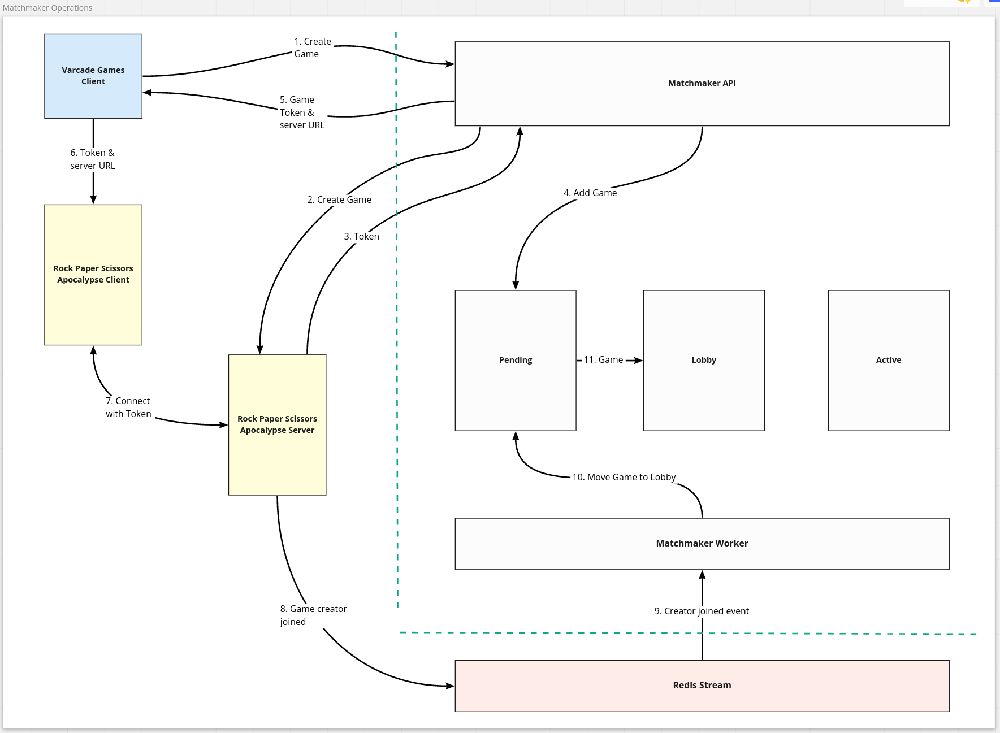
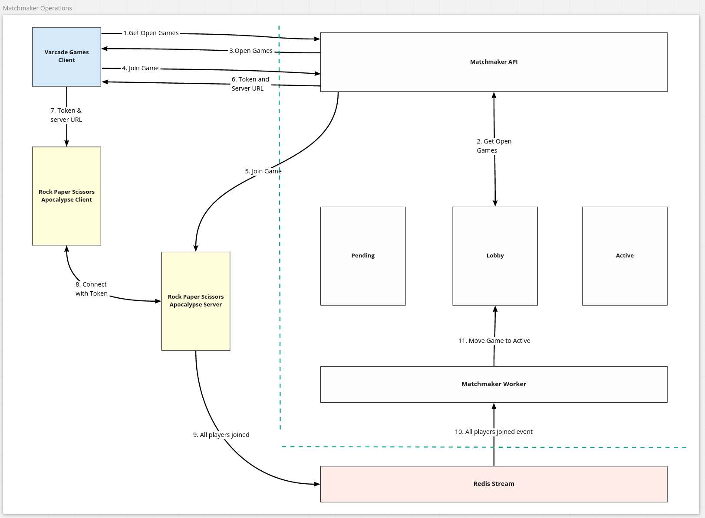

## Key Concepts

### Creating a Game

Understanding how the Matchmaker works is a lot easier with pictures, but even then it can look complicated - but don't worry it's actually quite simple.

The following diagram shows what happens when a game is created and then the creator of the game joins the game (by join I mean actually connects to the game server).

Take a moment to study this image before proceeding to the explanation of each step:

Ok there's quite a lot going on there so let's break it down and look at it step by step.

Immediately you should notice that we've not got multiple different services involved here. The is the first time we're seeing all of the various different components of Varcade Games all working together.

***

**1. [Game Portal]    Create Game via Matchmaker**

The first step in this process is opening up Varcade Games. Then we select a game and select multi-player mode. 

This should open the Matchmaker UI, which is our gateway to the Matchmaker.

When a player chooses to create a new multi-player game a request is sent to the Matchmaker server.

**2. [Matchmaker]     Create Game on Game Server**

The Matchmaker server then needs to connect to the game server for the selected game and ask it to create a game.

**3. [Game Server]     Get Token**

The game server will create the game for the matchmaker and then return a token that can be used to connect to that game.

**4. [Matchmaker]     Add Game to pending set**

Once the remote game has been created the Matchmaker them adds the game to something called the 'Pending set'.

We do this because we don't consider a game actually active until the player that created it actually joins. 

We're trying to avoid the scenario where players can join a game but the person who created it in the first place is not there and ready to play. 

**5. [Matchmaker]     Return game token and server URL**

Once the game is created and in the set of pending games the Matchmaker returns the token for the game and the URL for the server that the game is running on.

This will allow a game client to actually connect to the game on the game server.

**6. [Game Portal]    Pass token and server URL to Game Client**

The game portal is what receives the token and server URL from the Matchmaker, then it passes them on to the game client (Rock Paper Scissors Apocalypse in our case).

**7. [Game Client]    Connect to game server with the token**

Now the game client can actually connect to the game server. It does so by taking the server URL and attaching the token to it before opening a websocket connection.

**8. [Game Server]    Send 'creator joined' event from game server**

Once the server verifies the token and actually attaches that players connection to the newly created game it fires an `event`. This event is a message that gets added to a Redis Stream.

At this point the player that created the game can select their character and then must sit and wait for another player to join their game.

**9. [Matchmaker]     Consume 'creator joined' event in Matchmaker**

On the other side of the Redis Stream our Matchmaker will receive the 'creator joined' event and handle it.

**10. [Matchmaker]    Remove the game from the pending set**

The Matchmaker will remove the game from the pending set as it is no longer pending - the creator has joined, so we are happy to now make that game available for other players to join.

**11. [Matchmaker]    Add the game to the lobby set**

The `Lobby Set` is the set of all games that are ready to be joined. Any games in this set will be displayed in the matchmaker UI as available to join.

!!!Hosts

    Inside our matchmaker we call any player that creates a game the `host` of that game.

    This is to differentiate between players that start a game and players that join a game.

    This allows us to make some simple decisions about game state.

    As we've already seen, a game cannot move from `pending` to `lobby` until the host joins the game. This is because we don't want to advertise a game for others to join if the person that created that game hasn't joined.

    This distinction between creator/host and joiner also matters when it comes to disconnects.

    If a player disconnects from a game we can put it back in the lobby set. If a host disconnects the game is destroyed.

    We don't *have* to do it like this, but a few simple constraints like this can greatly simplify our concepts and our code.

That's it for game creation. Next let's look at what happens when a player joins a game.

***

### Joining a Game

Having been through the 'create game' flow, hopefully this one is a lot easier to understand.

Let's break this one down too and think about some of the details.

***

**1. [Game Portal] Get open games request**

Before joining a game you need to know if there are games available to join in the first place. When you open the Matchmaker UI in the game portal it will automatically send a request to the Matchmaker server to get a list of currently open games.

**2. [Matchmaker] Fetch open games**

These games come from the `Lobby set` we discussed in the previous section.

**3. [Matchmaker] Return open game list to the client**

The Matchmaker server then returns all of the games that are open to join to the game portal.

**4. [Game Portal] Send join game request to matchmaker**

The game portal can now send a join request and does so by sending the ID of the game it wants to join to the Matchmaker server.

**5. [Matchmaker] Send join game request to game server**

The Matchmaker then needs to verify that this player can join the game (the game is not at capacity already).

**6. [Matchmaker] Return token and server URL to Game Portal**

If the player can join the Matchmaker server will return the token for the game and the URL of the game server back to the game portal.

**7. [Game Portal] Pass token and server URL to Game Client**

The game portal hands the token and game server URL off to the game client so it game join the game.

**8. [Game Client] Connect to game server with the token**

The game client connects to the game server and the player is presented with the character selection scene.

**9. [Game Server] Send 'all players joined' event from game server**

The game server will now send an another event out on the event stream. This time it is 'all player joined', signifying that the game server now has everything it needs to progress with the game.

**10. [Matchmaker] Consume 'all players joined' event in Matchmaker**

The Matchmaker server is listening out for the 'all players joined' event. 

**11. [Matchmaker] Move game to the active set**

Once received it will remove the game from the `Lobby set` and add it to the `Active set`.

This means the game will no longer show up in the Matchmaker UI.

!!! Note
    The Matchmaker also listens out for 'disconnect' and 'game over' events.

    If a non-host disconnects the game will be placed back into the 'Lobby set', where a new player can join.

    Once a 'game over' event is received the game will be removed from the Matchmaker database.

***

### Summary

Hopefully this all makes sense at this point.

The Matchmaker is just a middleman. It creates multi-player games on game servers on behalf of the players and monitors the state of those games via messages coming from the Redis Stream. 

The goal of the Matchmaker is to offload the burden of managing a multi-player lobby from the games. Any games that want to make use of the Varcade Games Matchmaker just need to register with the Matchmaker and conform to some API requirements.

With that in mind, let's take a look at how to actually work with it.