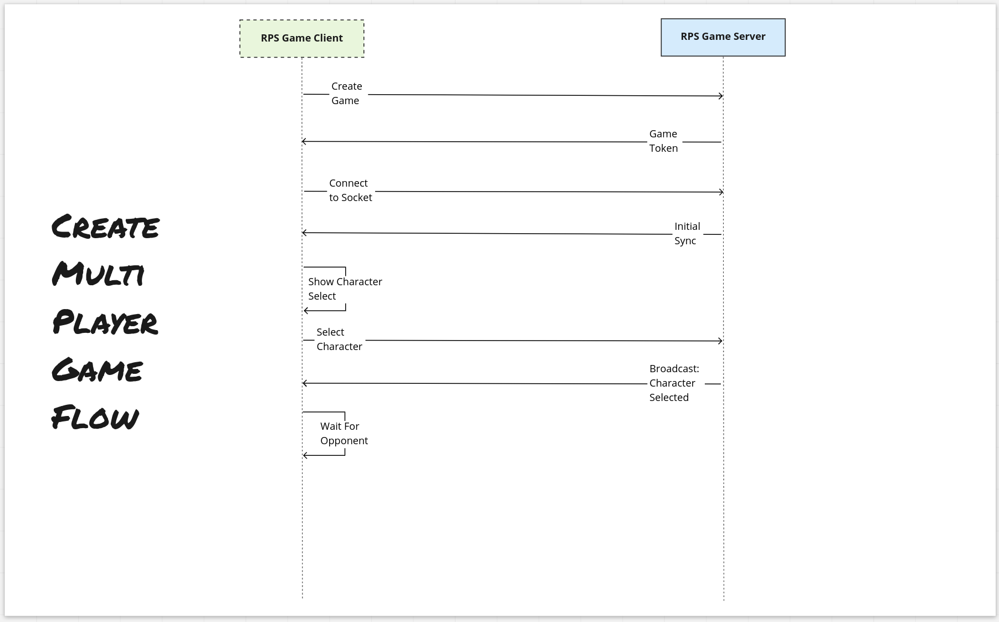

Before we look at the actual code, let's take a high level look at the design of the system and some of the important concepts at play.

## Game State

First off, the Rock Paper Scissors Apocalypse (RPSA) game server is a `stateful server`.

This means that it keeps all of its state in memory. This means that all of the games being played on the server are not saved to any persistent storage (like a database or hard disk). If the server dies all of the games are lost.

This is a trade off I was happy to make in this case, because games are transient by nature. They are quick and self contained. If you're playing a game and server dies you only lose the progress for that game - it's not that big a deal.

The benefit we get is that the server is quite simple and can be quite fast - since everything it needs is right there in memory.

But what is the game state?

Put simply the game state is: 

>The set of all games being played at any moment in time, and the players that are playing those games.

To understand exactly how this works lets go back to some of the sequence diagrams we saw earlier in the documentation.

This time I've simplified them so that there are no Varcade Games components or Matchmaker components. Right now we're only interested in the game, **which can be run completely standalone**. Remember that, as it is much easier to work on just the game, without worrying about the game portal.

### Creating a game

Take a moment to digest that image.

The first thing that happens is that the game client creates a new game. It does this by sending a request to the game server. This is a normal HTTP request - just like any request you send through your browser.

!!!note
    When a game is running from within Varcade Games it does not directly call the game server to create a game. The Matchmaker does that.

    In fact we actively hide this ability from game clients when deploying live. We want the matchmaker to act as a sort of security guard when it comes to creating and managing games.

When the game server receives a request to create a game it will do exactly that. It will create a game (we'll see exactly how in the code later) and it will generate a `token` for that game. This token is how we control exactly who can connect to and play the game that was just created.

Once the client has a token it can go ahead and connect to the game. This is where things change - this time the client will talk to the server over a `Websocket`.

Earlier when we create the game we used the standard HTTP request-response model. This is where a client sends a request to a server, the server then does something and responds with an answer. That's it. It's a single interaction.

When we open a `socket connection` (in this case a **websocket**) that we're doing is creating a connection between the client and server. Once this connection is established, the client and server can freely send data to eachother as they please.

Think about it like mail vs telephone. 

If you send someone a letter you have to wait for it to be delivered. They read it. Then they respond. 

If you call someone on the phone, you have a connection to them where you can both communicate at will. 

In our game client, once the socket connection has been created we can go ahead and allow the player that created the game to make their character selection.

Once they do that, they need to sit and wait for another player to join.

!!!Note
    We'll talk about what happens when no one joins later when we get to the Matchmaker.

### Joining a game

The join game flow is quite similar, except the first thing the player has to do is get a list of available games to join.

Once they have that list they can ask the server join one of them (the server may say no, if for example the game has already reached max capacity).

Once we have a token the rest of the flow is the same are the creation flow. The joining player selects their character. Once both players have their selection made the game can begin.

At this point we have a server with an active game and two active websocket connections.

***

Now we're ready to dig into the actual system design - what is actually happening behind all of those concepts we've just gone through?