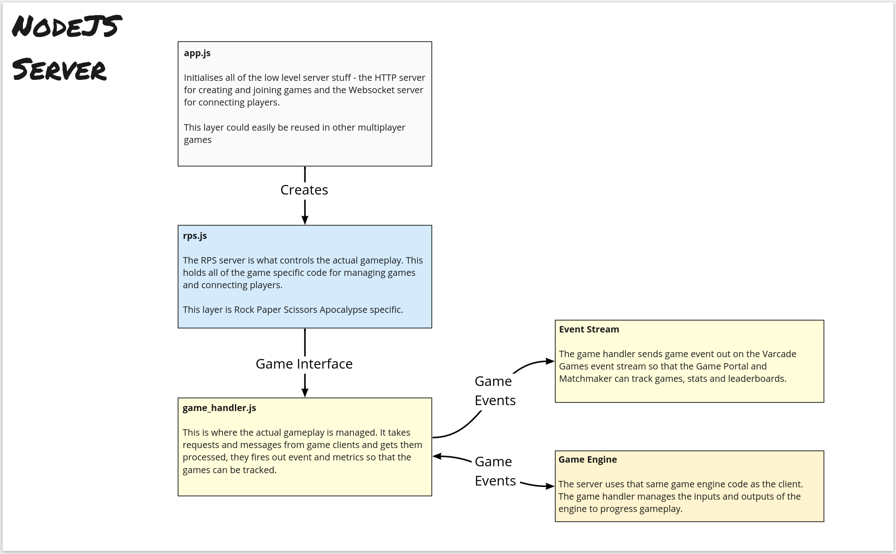
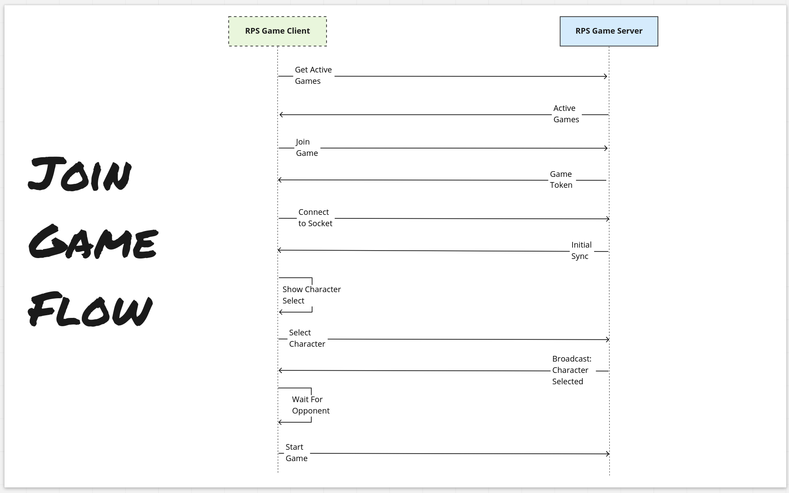

The game server doesn't actually have all that much code.

The game engine is a separately library that is shared between client and server, so the server doesn't need to worry about gameplay really.

What it needs to do is create games and listen for player interactions and send messages and forth between the server and the game client.

That's the server's main priority.


## Structure

The diagram below shows some of the layers and interaction you will find in the server code.

[](img/rpsa_server_design.png)


!!!Note
    There is also an `index.js` file. It is the file that the NodeJS server launches. It just has some basic startup configuration in it. We don't need to consider it for now.

### The HTTP Server

So the entry point to our game server is `app.js`. 

It's here that you can see the various other game server components getting initialized:

```js
// Metrics
const metricsMiddleware = promBundle({
  includePath: true,
  httpDurationMetricName: 'game_rps_server_http_request_duration'
}) // Prometheus middleware

// HTTP Server
const app = express()
app.use(metricsMiddleware)
app.use(cors())
app.use(express.json())
app.use(httpLogger)

// Rock Paper Scissors Game Server
const rpsGameServer = new RPS.RPSServer(promBundle.promClient)

```

First up there are some metrics, so we can monitor the game server and make sure it's performing ok.

Then the HTTP server we need for game management. We are using a popular HTTP server for NodeJS called `Express`. You can check out the official docs [here](https://expressjs.com/){:target="_blank"}.

If you look down below the initialization section you will see where we set up 'routing' for Express JS. This is how we register endpoints for our game client and matchmaker to connect to when they want to create or join a game.

```js
app.post('/create_game', function (req, res) {
  logger.info('Received create game request: ${JSON.stringify(req.body)}')
  if (!validateGameRequest(req, res)) {
    return
  }
  try {
    const gameData = rpsGameServer.createGame(
      req.body.gameId,
      req.body.userId,
      req.body.username)
    res.json(gameData)
  } catch (err) {
    if (err instanceof RPSErrors.ValidationError) {
      logger.warn('Unable to create a new game, error message: ${err.message}')
      sendErrorResponse(res, 400, err.message)
    } else {
      logger.error('Unable to create a new game, error message: ${err.message}')
      sendErrorResponse(res, 500, 'An unexpected error occurred while trying to join the game.')
    }
  }
})
``` 


Here we're adding a new endpoint to the `app` object, which is our reference to an Express server. This endpoint will accept 'POST' requests from clients that send requests to '/create_game'. 

### The Game Server

Once our metrics and HTTP server are set up we can create the game server:

```js
const rpsGameServer = new RPS.RPSServer(promBundle.promClient)
```

RPSServer can be found in `game_server/rps.js`.

It is what connects players to games and manages the various events that are fired during a game.

This makes it one of the more complex pieces of code in the project. But don't worry about that, how it works is pretty straight forward. 

RPSServer has the following member variables:

```js
this.activeGames = {} // Maps a game ID to a GameHandler.MultiPlayerGame object
this.tokenGameMap = {} // Maps game tokens to game IDs
```

When we create a game we generate a token. 

Then we add `token: game_id` to the `tokenGameMap` object.

Finally we add `game_id: game` to the `activeGames` object.

Remember our sequence diagram earlier, where the Game Server returned a token to the game client? That is this token.

When a player connects to a game server a token is supplied. The game server can then map that to a game ID and look up the corresponding game.

### Joining a game

[](img/join_game_flow.png)

We do this because game IDs are shared with the Game Portal client, so nefarious players could potentially connect to games directly without going through the matchmaker.

Most of what this class is doing is initializing the websocket connection, handling messages coming from the game clients and dealing with error scenarios, like if a connection drops.

So we're still not playing the game yet - for that we need to once again consider the Game Engine.