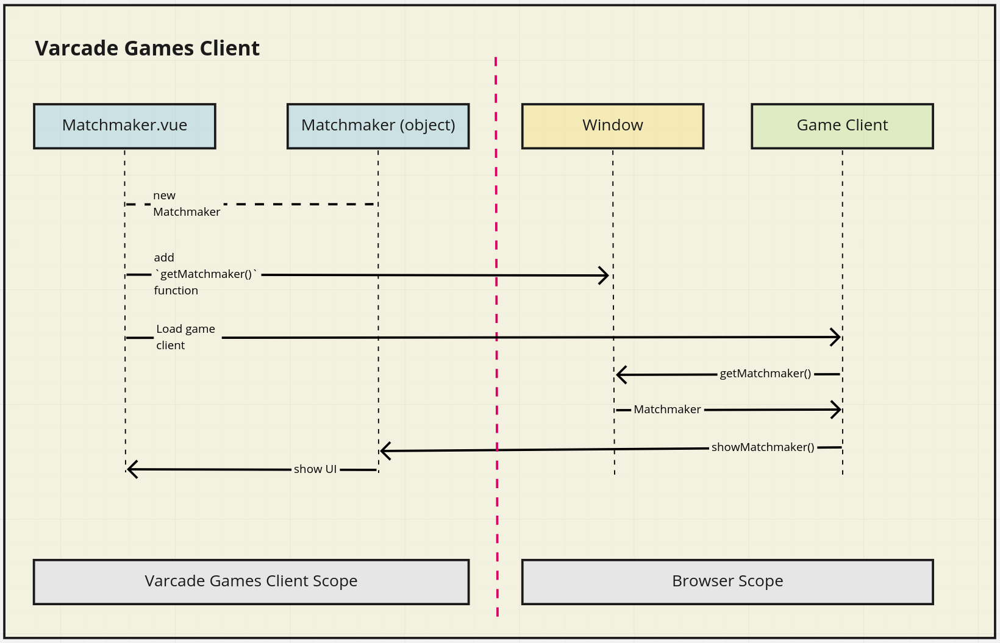

# The Matchmaker

The Varcade Games client comes with some built-in functionality that allows players to create and join games online.

Game developers can hook into this built in functionality to interact with our matchmaker server.

So what we have is:

* A matchmaker SDK
* A matchmaker server

The Varcade Games client provides the SDK and manages interactions with the Matchmaker so that game developers don't need to. 

The UI for creating and joining games will be consistent across all games in the portfolio. 

## The Matchmaker SDK

Open up `website/client/src/components/wp-active-game.vue` again.

You may have already noticed there is a custom component in there for the matchmaker:

```html
<wp-matchmaker :game-id="gameId"/>
```

If you open up that file, `website/client/src/components/matchmaker.vue`, you will see that it contains a `modal`:

```html
<modal name="matchmaker-modal"
        width="800"
        height="600"
        :scrollable="false"
        :reset="true">
...
```

A modal is a piece of UI that appears over our main UI. Hopefully you have seen this in action already. When you click `Multi-player` on the Rock Paper Scissors Apocalypse main menu a window pops up. That is a modal, and this is where it is defined.

One function worth checking out at this point is the `initMatchmaker` method:

```javascript
initMatchmaker: function () {
    if (!this.matchmaker && !window.getMatchmaker) {
        const matchmaker = new Matchmaker(this.gameId, this.$store, () => {
            this.$modal.show('matchmaker-modal');
            this.refreshGameList();
        });
        
        this.matchmaker = matchmaker;
        window.getMatchmaker = function() {
            return matchmaker;
        }
    }
}
```

This is how we expose the Matchmaker functionality to the game client.

We create an instance of a `Matchmaker` object. We then attach a function called `getMatchmaker` to the global Javascript `window` object.

### The Matchmaker Object

The above code initializes the Matchmaker object here:

```javascript
new Matchmaker(this.gameId, this.$store, () => {
    this.$modal.show('matchmaker-modal');
    this.refreshGameList();
});
```

To understand a bit better what is going on here, let's look at the source. Open up `website/client/src/matchmaker.js`.

This class is an interface to the Matchmaker server. It exposes all of the functionality of that server to the Varcade Games client, for example:

* Get a list of open games
* Create a new game
* Join an existing game

The matchmaker also provides a hook for the actual game client to hook into the matchmaker. 

Remember earlier on when we attached our Matchmaker object to the `window` object?

Game client can access that same `window` object. Any Javascript executing on the page can.

So that the game client does is call `window.getMatchmaker()`, and if a player selects `multi-player` they can call `matchmaker.showMatchmaker(callback)`.

The whole thing looks something like this:

[](img/vcg_matchmaker_flow.png)

It's worth spending a minute going through this diagram.

First off, you should notice that I've split the diagram in two with a red dotted line.

It's important to not what exactly is within the scope of the Varcade Games Client and what is not.

Within the client we have a matchmaker Vue file, which is responsible for the matchmaker UI, and we have a matchmaker object, which is a normal object that provides access to the matchmaker server and the matchmaker UI. 

But next to those two we have a `window` object and the actual game client (the graphics and gameplay etc...).

The window is a global Javascript script object that represents a tab in your browser. So every time you open up a new webpage in your browser, that webpage has access to this global object.

That means that any Javascript running on that page also has access to it. We use this fact to share our matchmaker object between two different applications running on the same page. 

One application is the Varcade games client. The other is the game, which has nothing to do with the Varcade Games client - it just happens to have been downloaded by it.

Since both have access to this shared object, they can now interact - and that is how clicking the multi-player button in the game UI can open a modal in the Varcade Games UI.

We'll look at exactly how the game client does this in a later section.

That's it for the matchmaker for now - we will come back and look at all of this in a lot more detail later on when we look at multi-player gameplay and the matchmaker server. 

But first, let's jump in to some single player Rock Paper Scissors Apocalypse.

