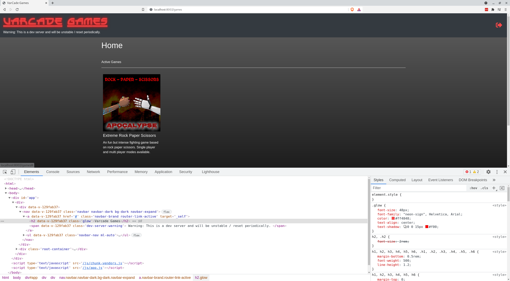
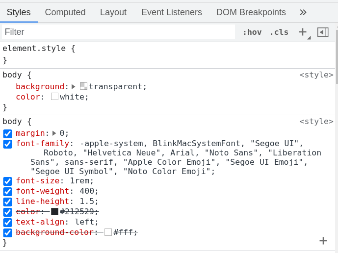
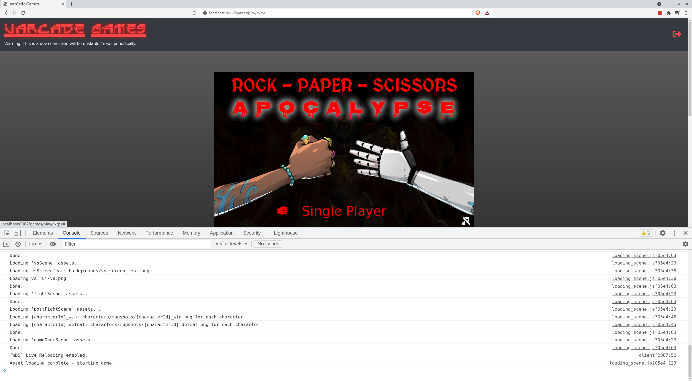
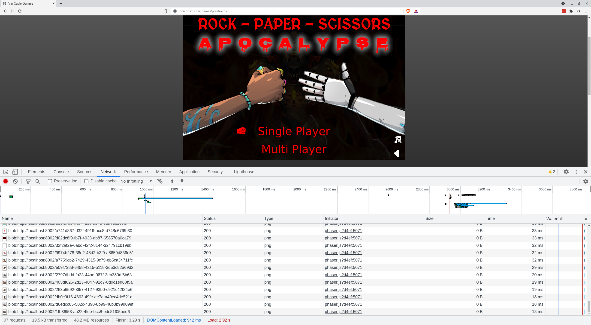

# Reverse Engineering

Now that we've been through the full project setup and you have seen some of the system architecture in detail it is time to spend some time digging around yourself. 

Let's start with your browser console.

## The Browser Console

If you've ever done any sort of web development you're likely familiar with the browser console as well as the value that it brings. 

If not, you're about to find out.

## Digging around in Varcade Games

If you development stack isn't running then go ahead and start it up.

Then open your browser to your local Varcade Games instance at `localhost:8002`.

Log in to some existing account, or create a new one if you need to. 

### Inspecting a webpage

Once you've arrived at the games page do the following:

1. Right-click on the `Varcade Games` title at the top left hand corner of the browser window
2. In the menu that pops up select the `Inspect` item

You should see something like this:

[](img/inspect.png)

You have just opened the built-in web browser dev tools. As the name suggests, this is a set of tools for developers.

Depending on the browser you are using (I am using Brave) this may look different, but most of the popular browser these days have more or less the same options available.

In our dev tools you'll be presented with some HTML.

More specifically, you are seeing the HTML that was created for displaying Varcade Games.

If you move your mouse over some of the HTML in the tools window you will notice that different elements on the page get highlighted.

You can even right click on the HTML elements to interact with them.

Try right-clicking the '&lt;body&gt;' tag and selecting `Delete element`.

Everything is gone!

This is expected - all we've done here is dynamically modify the HTML in our browser. 

But don't worry, refresh the page and everything will come back, just the way it was.

You can open up these dev tools on any web page that you visit and have a look around at how they structure their website. 

Some will be complex, others less so - but it's always interesting to jump in and have a look at how your favourite websites are built.

Spend some time digging around in the HTML. Try removing some elements and see what effect it has on the page.

Everything you see and do here will be valuable for when you actually start working on the project.

### Styling

Along with the HTML you'll also notice a section in the dev tools for CSS. In my case it's on the right hand side of the window under the heading `Styles`.

Any CSS that is defined for the page you are viewing will show up here - and yes you can go ahead and modify this too.

This tool is particularly useful when you are actively designing and building a page as you can change values here to get quick feedback on how it looks before you go ahead and modify your CSS files.

So let's play with it.

Left-click on the body tag. In the styles section of your dev tools you should now see some style information for the body of our webpage.

[](img/vcg_body_style.png)

Notice that if you uncheck the `background` entry, the page background turns white.

If you uncheck the `color` entry then all of the text on the page turns black.

Two things worth noticing in this UI:

1. Sometimes unchecking a style doesn't do anything!
2. Some of the styles are crossed off!

To address the first point, it's worth understanding what CSS actually means. It stands for `Cascading StyleSheets`. 

The word `cascading` is the one that matters here. It means 'to pass on'.

What is happening here is that the `body` element in our CSS defines some styling, but other elements on the page may choose to define *their own styling*.

So the information in the `body` style will cascade down through all child elements, *but* that does not mean that the child elements need to use that style, they may have their own style - as children often do.

That leads on to the second point. When you see an entry in this list crossed off then it means some CSS has been defined elsewhere that overrides it.

In our case, we have overridden the default body style that colors text black so that we can color it white. 

If you uncheck the box beside the `color: white` style you will notice that the `color: black` style is no longer crossed off. That is because we are no longer overriding in.

Using these tools you can play around with different styles and visuals for your pages (or other peoples pages if you like!).

### Adding new styles

In the style window you should see an entry called `element.style` or just `element`.

If you click that entry you can add what ever styling you want to the selected element

Trying copying and pasting some of these style changes into that section and notice the difference it makes to the webpage:

* background: red;
* margin: 100px;
* font-size: 2em;

## The Console

The page inspector is great for understanding the layout and styling of any given webpage - but modern webpages are a lot more than just structured content and pretty colors.

They're active. Especially in the case of the pages that contain our games.

Active pages means there is some Javascript running somewhere - and where there are scripts running we need logs to understand what the hell is going on.

[](img/vcg_rpsa_console.png)

Along the top of the dev tools section of your browser window there should be a 'Console' tab. 

Whenever you write some Javascript for a browser and write to the console it shows up here. So for example

```bash
console.log("Hello World")
```

Running this Javascript in a browser will print `Hello World` to the console.

In our console you can see there is a lot more going on, but before we dig in - let's get a fresh view of the information.

First open up the game page so you can see `Rock Paper Scissors Apocalypse`.

Then refresh the page to captured all of the output that comes with loading this page.

If you scroll up towards the top you should see some messages like this:

```bash
...
Phaser v3.55.2 (WebGL | Web Audio)  https://phaser.io
Checking local storage for save data...
Game loading...
Game loaded.
Boot complete - loading assets
Loading assets...
Loading 'global' assets...
Loading icons: ui/icons.png,50,50
Loading bgMusic: audio/battle.wav
...
```

This is what is being logged by the game client to help us understand what is going on.

The short snippet above shows the game starting up and then beginning to load assets (the images/audio etc...).

It's worth noting that *not all of these logs are coming from code we wrote*. Some of the log messages are coming from Phaser - the 2D game engine we are using. Some of them are coming from Vue.js - the web framework we are using.

You don't need to understand any of these logs just yet, but you need to know they are there.

Leave the console open and try navigating around the website, playing the game, playing multi-player etc... and see what is being printed out there.

Understanding how to find and interpret logs will be vital later on when you start extending Varcade Games.

## Networking

The final section of the browser dev tools we're going to look at here is the **Network** section:

[](img/vcg_network_inspect.png)

Again this may look slightly different in your browser, but the concepts are all the same.

Select the `Network` tab in your browser and refresh the page.

What you're looking at here is all of the `requests` that your browser sent to the server in order to load the page. In our case it there are requests be sent to multiple servers as we load the:

* Page's HTML
* Page's Javascript
* Page's CSS
* Game's Javascript
* Images for the game
* Audio for the game
* Leaderboard and player stats for the game

In the table of requests we can also see the `Status` of the request, the `Type` of resource being requests (image/script/text etc...) and a few other bits of useful information about the size of the response and the amount of time it took.

If you click on any one of the requests you will get a lot more information about it:

[](img/vcg_network_request.png)

The request in the image above is the request to fetch the actual game code for Rock Paper Scissors Apocalypse.

Have a look at the request URL. It is `http://localhost:8090/main.js`.

Is this URL familiar for any reason?

Cast your mind back to when we set up the game in the Varcade Games admin panel. For every game we entered a URL... the above URL is that URL.

Coincidence? No.

When we register a game with Varcade Games we tell the system where the game code is located, and this is the point where we actually call that URL to get the game code.

Again, these tools are all interactive. You can modify and re-send requests if you like, or preview the response data.

## Exploration

Ok - I think you are now armed with enough information to start exploring and trying to reverse engineer some of what is going on behind the scenes are Varcade Games.

Like I said before - jump in, click things, break things. Any damage you do and be undone by refreshing the page.

And most importantly: **think**.

As you explore the website using the devtools, have a think about:

* What does this request do? 
* Why does this one take longer than that one?
* What happens if I remove this HTML element?
* What would the game page look like with a red background? 
* What happens if I change the URL in the admin panel? Will the game break?
* What are all of these messages in the console?

And don't be afraid to look things up. Head over to [Duck Duck Go](http://duckduckgo.com) (or Google... I suppose) and search for some of the words you see but don't understand.

This exploration and research is far more valuable than anything you read here or watch on some tutorial video.

***

Notes:

* There are some practical applications for the console in your day to day life, for example if you're viewing a webpage and it has an annoying flashing ad, or and image you don't like, you can open up the console and remove it!
* The next time some webpage stops working as expected, try opening up the console and having a look at the logs. If you need to contact support the information you find here might be useful.