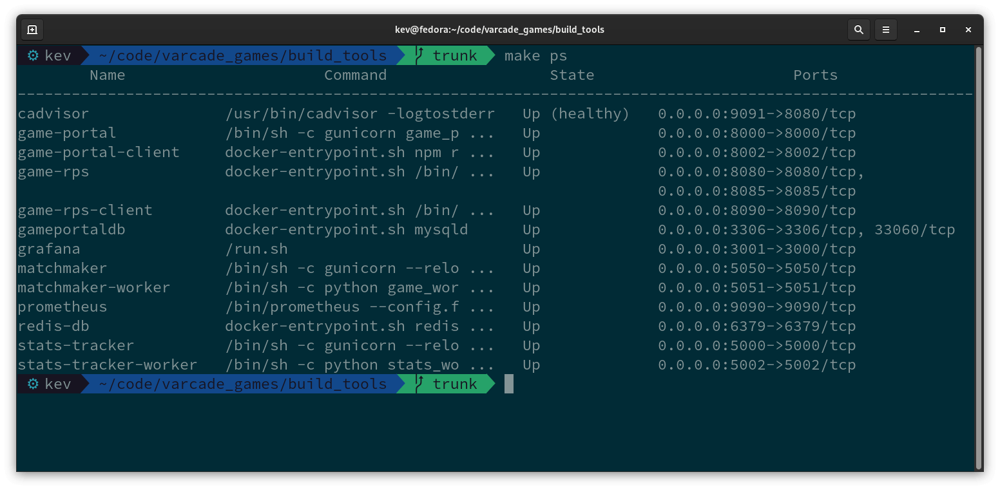

# Introduction

A Varcade Games development stack can be set up on Windows, Linux or MacOS. 

You may or may not have heard of Linux or MacOS. They are `operating systems` (OS). When you start up you computer you `boot` the operating system, which is what allows you to actually do things with the computer.

Most people are familiar with Windows as it comes pre-installed on most PCs, but there are other options out there too - Linux being the main on.

MacOS is the operating system that runs on Mac computers.

In terms of effort, Linux is definitely the easiest environment to set up, followed by by MacOS. 

Windows is a bit more involved - but it's an upfront cost that you only need to pay once.

This is why many software engineers actually prefer to use a Mac or a machine that runs Linux - they are more 'developer friendly' in many cases, especially for server side development.

In general I would recommend working with Linux as it's an extremely valuable skill to have as a software engineer, but the choice is yours. 

If you are running Windows we will actually set up a kind of Linux on your machine during this course, so you will be using a Linux system, but from the comfort of your Windows environment. Hopefully this experience will be enough to make you take the plunge and switch over to using Linux full time.

Follow the guide for whichever OS you are using to get setup:

* [Linux](../linux/)
* [Windows](../windows/)
* [OSX](../osx/)

!!! info
    If you've already got Docker set up and you know what you're doing you can skip straight to the [Testing your setup page](../testing_your_setup/).

!!! info
    Technically I should say GNU/Linux and not Linux when referring to this operating system - but this isn't the time or place to get into that.