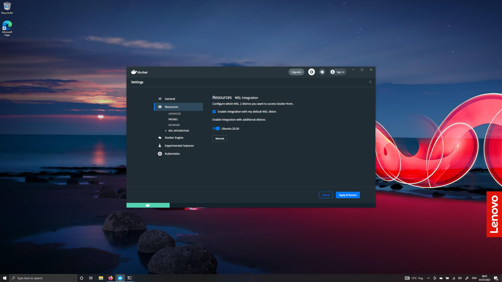
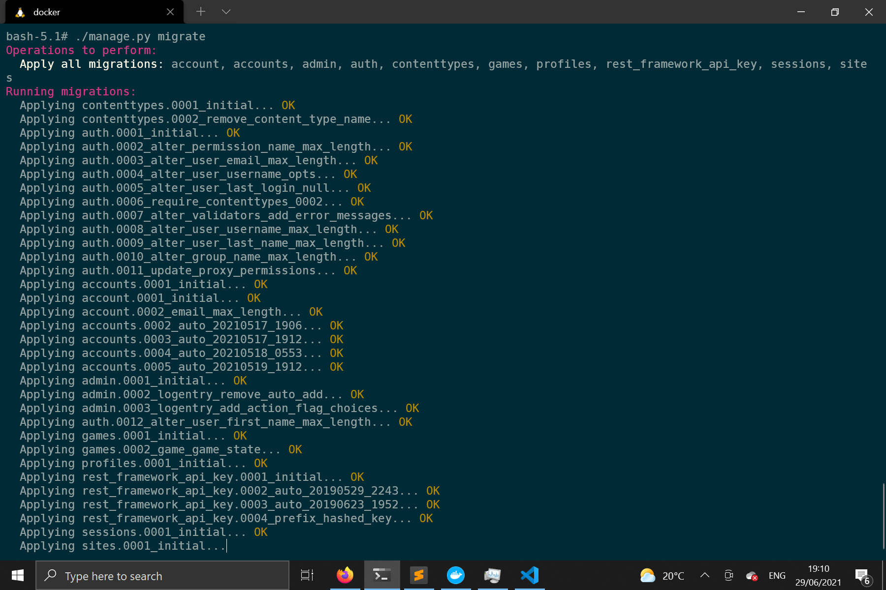

# Building the applications  

From your terminal, open the `build_tools` directory:

```bash
cd varcade_games/build_tools
```

Now run the following command:

```bash
echo "ENV_CODE_OVER_TIME_ROOT=~/code/varcade_games" > .env.local
```

There should now be a new file in the `build_tools` directory called `.env.local`. This file tells the build scripts where the code is, so it's pretty important.

!!! info 
    The above commands assume that you put all of the project code in the `~/code` directory, as directed earlier in the course. If you cloned the code to a different location you will need to update the path of the Varcade Games directory accordingly. 

***

## Building Varcade Games

Next we need to install an additional tool for building and running the project:

* Make - A standard tool for creating and running build scripts

### Windows (Ubuntu terminal) / Linux

```bash
sudo apt install make
```

!!! info
    This command assumes you are running on Ubuntu, you will need to update to fit your distro if you are not running Ubuntu.

### MacOS

On MacOS you should already have the developer tools installed from a previous step. This will include Make already so you should have nothing to do here.

### Docker

Let's also make sure Docker is running, you can check this by running the command:

```bash
docker ps
```

As long as you don't see an error you should be good to go.

#### Windows

On Windows it's worth double checking our Docker settings. Open Docker and open the setting screen to:

`Docker > Settings > Resources > WSL Integration > Enable integration with additional distros` 

Make sure that `Ubuntu-20.04` is checked in the `Enable integration with additional distros` section:

[](img/docker_for_win_enable_ubuntu.jpg)

***

## Running the build
 
Back in your terminal, run: 

```bash
make build
```

This will kick off a build of the various different applications. This will take a few minutes as all of the dependencies will need to download.

Nearly there!

***

## Running the applications

All we need to do now is run `make start` from the terminal.

That will start up all of the applications and you can check their state by running `make ps`.

If any of the services fail to start, run `make start` again (game-portal will likely fail to start as it depends on the DB starting up first). 

***

## Configuring the site

Before we can actually interact with Varcade Games we need to initialize the database.

Run the following command to connect to the `game-portal` application:

```bash
docker exec -it game-portal bash
```

Next run:

```bash
./manage.py migrate
```

You will see some output like this:

[](img/game_portal_migrate_output.png)

Next run:

```bash
./manage.py createsuperuser
```

You will need to follow a few steps to create your admin user account for managing Varcade Games. 

Once that's done type `exit` and hit enter to get back to your Ubuntu terminal.

We have one final thing to do - that is set up our local networking environment.

***

## Connecting to Varcade Games

### On Windows

Open `notepad` as administrator.

Then select `File > Open` and navigate to `C:\Windows\System32\drivers\etc\` and open the file called `hosts`. The directory may appear empty, so be sure to select `all files` from the drop down at the bottom right that says `text files`. 

Add the following line to the bottom of the file:

```bash
127.0.0.1   varcade.local api.varcade.local games.varcade.local matchmaker.varcade.local rps.varcade.local
```

Save and close notepad.

### On Linux / MacOS

Add the following line to the bottom of `/etc/hosts`:

```bash
127.0.0.1   varcade.local api.varcade.local games.varcade.local matchmaker.varcade.local rps.varcade.local
```

The following command will take care of that for you:

```bash
sudo -- sh -c 'echo "127.0.0.1   varcade.local api.varcade.local games.varcade.local matchmaker.varcade.local rps.varcade.local" >> /etc/hosts'
```

### Viewing the site

Now, if you point your browser at `localhost:8002` you should arrive at the landing page for `Varcade Games`.

You can log in with the username and password you entered in the previous step when you ran `./manage.py createsuperuser`.

Unfortunately there won't be much to see. 

We need to add game...