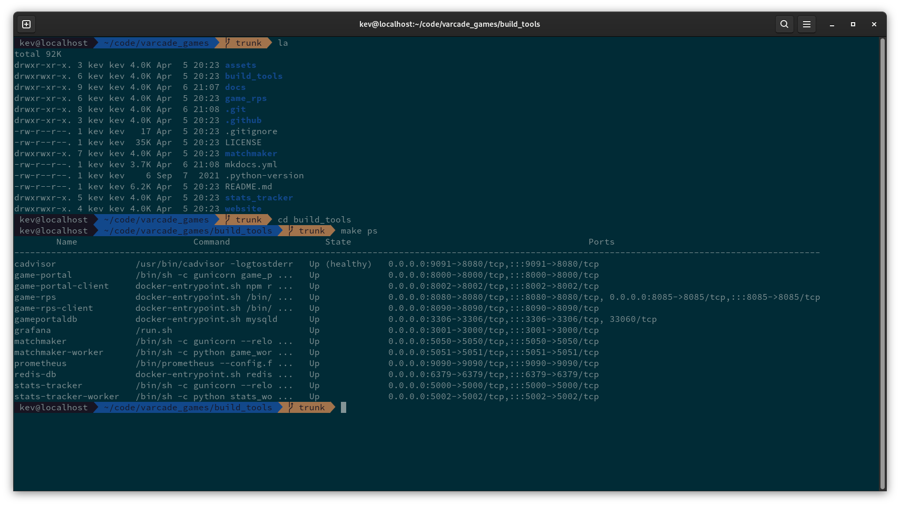

# Command Line Interface

A friend once said to me "Your computer screen looks like my computer when it's broken".

They were talking about this:

 
This is what we call the 'command line'. You may also hear people refer to it as a 'shell' or 'terminal'.

It can be confusing and complicated at first, but really it's no different to a standard Windows computer with a desktop, folders and pretty icons. The key difference is that rather than clicking on things to interact with them, we have to type commands.

In the above image you can see that I issued three commands. Two of which gave me some output, one of which didn't. Don't worry about the specifics of those commands for now - just know that interacting with the terminal involves typing commands and hitting enter. These commands may produce some output or may not - it depends on the command.

This might seem like a difficult way to work, and it can be - in the beginning. The learning curve is steep, but once you learn you can become a lot faster and more efficient by using the command line.

One reason for this is automation. If I'm just typing commands, I can write down a series of commands and tell the command line to run them one after another. If I save those commands to a file I can re-run them whenever I want. That file would be called a 'script'.

Here is a very basic but valid script that simply tells me what folder I'm looking at and what files are in that folder:

    pwd
    ls

This is a lot harder to do with clicks and graphics.

Having said all of that, working with the terminal day to day is not a requirement. I know plenty of engineers who rarely touch the terminal. 

However when working on a server it usually will be a requirement.
